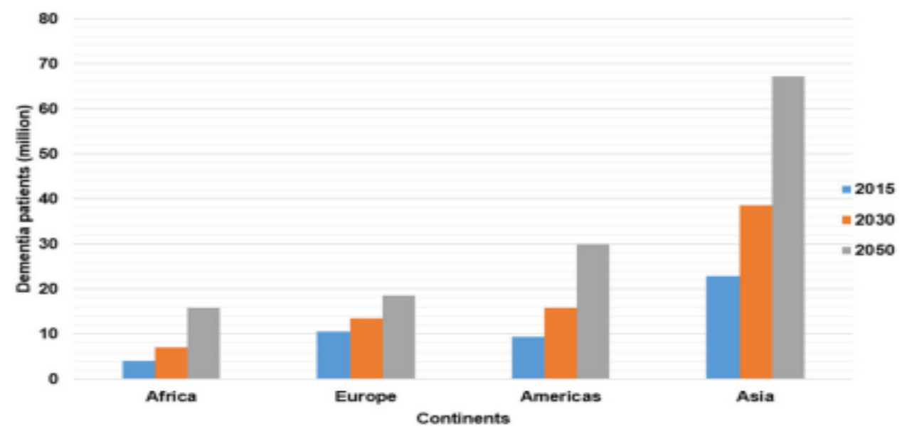
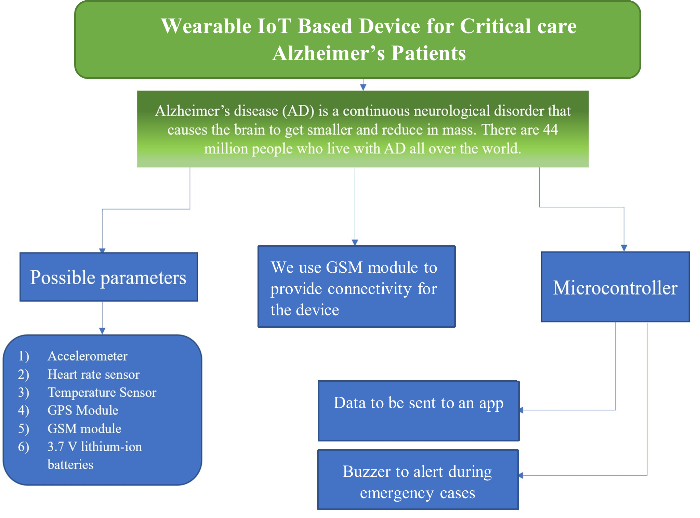
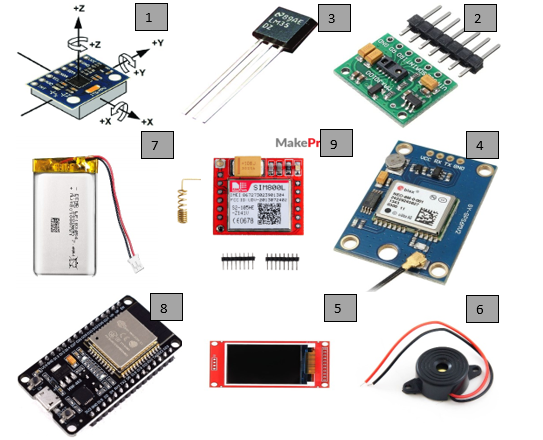
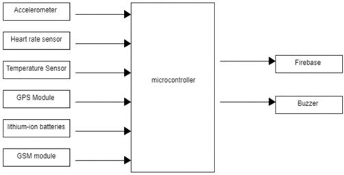
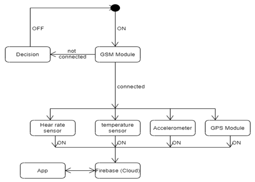
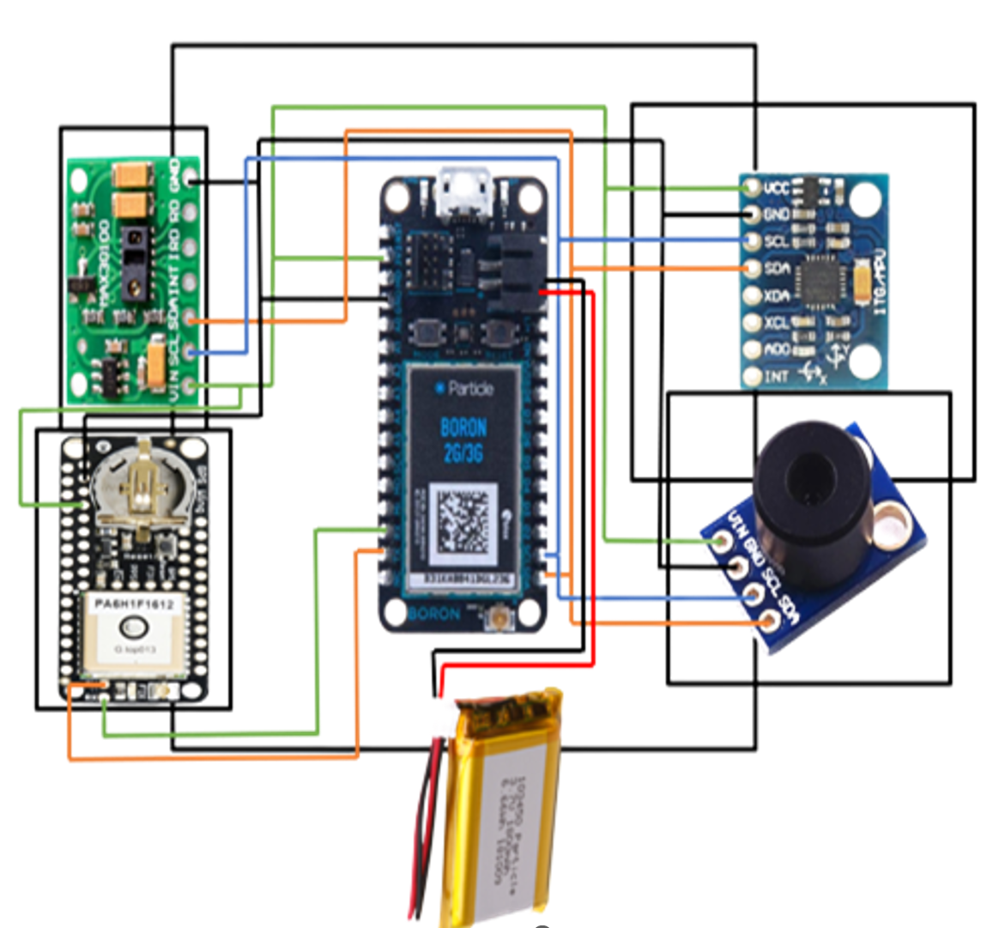
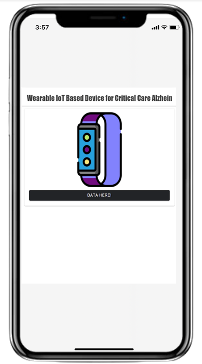
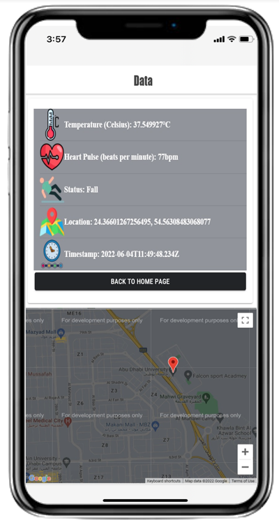
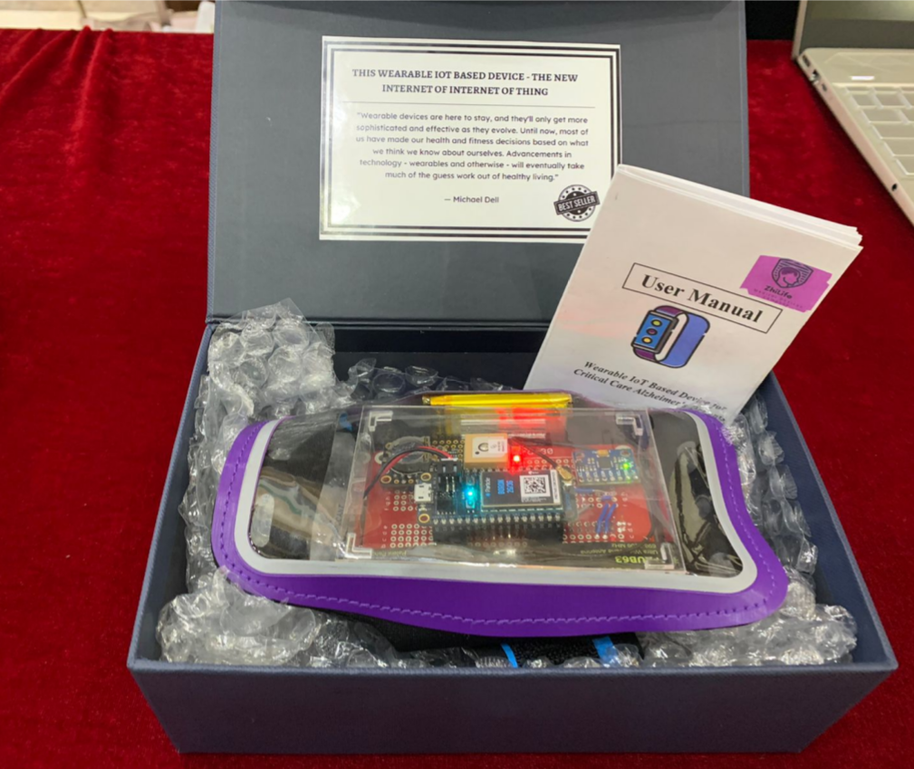
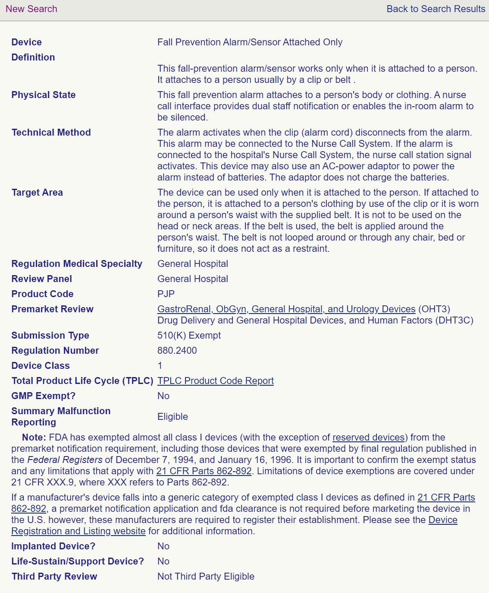

# Wearable IoT-Based Device for Critical Care Alzheimer's Patients

## Overview

Alzheimer’s disease (AD) is a progressive neurological disorder causing **memory loss, cognitive decline, and loss of independence**. It is a leading cause of disability among the elderly, affecting millions worldwide. By **2030**, an estimated **74.7 million people** will be diagnosed with AD, increasing to **107 million by 2050**.

A major challenge faced by AD patients is **wandering and disorientation**, leading to safety concerns:

- **41%** of patients get lost outside their homes.
- **30%** get lost inside their own homes (UK data).
- **70.7%** of AD patients in Taiwan report wandering incidents.

Additionally, AD patients have an **increased risk of falls**, leading to serious injuries due to **postural imbalances and motor impairments**.

Therefore, this project presents a **Smart Wearable Medical Device (SWMD)**—an advanced **IoT-based hand-band** designed to:

- Track patients' **location** via GPS.
- **Detect falls** and notify caregivers immediately.
- Send **emergency alerts** in critical situations.
- Monitor vital biomarkers, including **temperature, heart rate, and body movement**.

It consists of:

1. A **wearable device** embedded with multiple sensors for real-time health monitoring.
2. A **cloud-connected application** using **Firebase** to store, synchronize, and display data for caregivers.

---

## Features

| **Feature**                          | **Description**                                                                                                 |
| ------------------------------------ | --------------------------------------------------------------------------------------------------------------- |
| **Real-Time Monitoring**             | Continuously tracks **heart rate, blood pressure, and oxygen saturation** for early detection of health issues. |
| **GPS Tracking**                     | Enables caregivers to instantly **locate patients**, reducing the risk of wandering and ensuring safety.        |
| **User-Friendly Mobile Application** | Displays **real-time health data** and sends alerts for **abnormal readings or emergency situations**.          |
| **Firebase Cloud Storage**           | Uses **Google Firebase** for secure, real-time data storage and synchronization.                                |
| **Communication Protocols**          | Utilizes **Bluetooth Low Energy (BLE)** and **Wi-Fi** for **seamless and power-efficient data transmission**.   |
| **Regulatory Compliance**            | Designed to meet **FDA and CE medical device regulations**, ensuring safety and reliability.                    |

---

## Components Used

1. MPU-6050 Acc & Gyro Sensor
2. MAX30100 Pulse Oximeter and Heart Rate Sensor
3. Texas Instrument LM35 Temperature Sensor
4. GPS GPS6MV2 module (Ultimate GPS FeatherWing)
5. LCD Display (1.8 inches)
6. Buzzer
7. 3.7V Lithium-Ion Battery (2000 mAh)
8. ESP32-WROOM-32 Particle Boron Microcontroller Module
9. SIM800L Module

---

## Methods

The system consists of multiple input sensors, a microcontroller, batteries, and output components to provide **real-time health monitoring and fall detection** for Alzheimer's patients. It provides **two primary outputs**:
- Sounds an alert when abnormal health readings or falls are detected.
- Sends real-time sensor data to a **cloud-hosted database** (Firebase) for remote monitoring.

### 1. Operational Process

1. The system turns on and connects to the **GSM module**. If unsuccessful, the device powers off.
2. Sensors capture and analyze health parameters and movement every **10 seconds**.
3. The microcontroller processes and uploads data to Firebase, ensuring real-time access.
4. If **fall detection** or **abnormal readings** occur, the **buzzer sounds**, and an **alert is sent** via the cloud to caregivers.

---

### 2. Hardware Connections

**Table 1: Connections between the Particle Boron and the Ultimate GPS FeatherWing**

| Particle Boron | Ultimate GPS FeatherWing |
| -------------- | ------------------------ |
| 3.3V           | 3.3V                     |
| GND            | GND                      |
| TX(D9)         | RX                       |
| RX(D10)        | TX                       |

**Table 2: Connections between the Particle Boron and MLX90614 Temperature Sensor**
| Particle Boron | MLX90614 Temperature Sensor |
|------------------------------|-----------------------------|
| 3.3V | Vin |
| GND | GND |
| SCL(D1) | SCL |
| SDA(D0) | SDA |

**Table 3: Connections between the Particle Boron and MPU6050 Acc & Gyro Sensor**
| Particle Boron | MPU6050 Acc & Gyro Sensor |
|------------------------------|-----------------------------|
| 3.3V | Vin |
| GND | GND |
| SCL(D1) | SCL |
| SDA(D0) | SDA |

**Table 4: Connections between the Particle Boron and the MAX 30100 Heart Oximeter sensor**
| Particle Boron | MAX 30100 Heart Oximeter |
|------------------------------|-----------------------------|
| 3.3V | Vin |
| GND | GND |
| SCL(D1) | SCL |
| SDA(D0) | SDA |

#### Hardware Schematic
  
---

### 3. Application

#### User Interface Screens

    
    

---

## Final Prototype

Designed and Packaged as a Certified Medical Device:

- The prototype is fully **labeled and packaged** for **medical use**.
- A **detailed User Manual** is available: [User Manual](./User%20Manual.docx).

---

## Risk Management and Analysis

A **full analysis of risks**, which includes details on risk identification, risk evaluation (matrix analysis), and risk control measures, is available: [Risk Analysis](./Risk%20Analysis.docx).

---

## Classification

### CE Classification

- **Class IIb**: The system is classified as **Class IIb** under **CE medical regulations**. Falls under **Rule 10** "Devices monitoring vital physiological processes where variations can pose **immediate danger**".

### FDA Classification

- **Class I**: Based on **similar fall detection devices**, the system meets **FDA Class I** criteria.

---

## License & Copyright

This project is licensed under the **MIT License**.

You are free to use, modify, and distribute this project for **educational and research purposes**, but proper credit must be given to the original author **(Noora-Alhajeri)**.

### **Copyright Notice**

© 2024 **Noora-Alhajeri**. All rights reserved.

Originally Developed: **June 15, 2022**
Uploaded to GitHub: **2024**

---

## Contact

For questions or collaboration, feel free to reach out:

📧 **Email:** [n.s3eedalhajeri@gmail.com](mailto:n.s3eedalhajeri@gmail.com)  
🌐 **LinkedIn:** [Noora-Alhajeri](https://www.linkedin.com/in/nsh-019)
